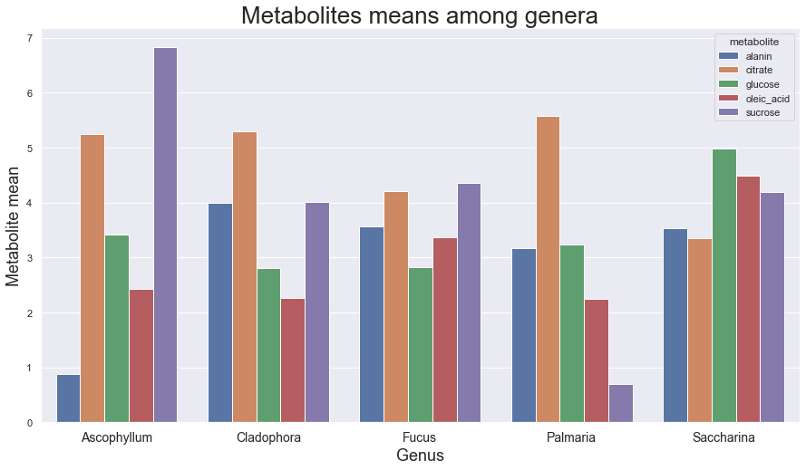

# Middle Test


```python
import pandas as pd
import seaborn as sns
import requests
from IPython.display import display, HTML
import cobra
```

## TASK 1

|  |[JUNDT]\*|APA\|OPI\|OLK|(NA\|FE\|HE)[CV]|
|--|--|--|--|
|**[DEF][MNO]\***|D|O|N|
|**[^DJNU]P[ABC]**|T|P|A|
|**[ICAN]\***|N|I|C|

## TASK 2

### Using pandas library find the average concentration of each of the metabolite in each aglae genus.


```python
alg = pd.read_csv("C:\\Users\\Evgenia\\Downloads\\data_for_task2.csv")
alg
```


<div>
<style scoped>
    .dataframe tbody tr th:only-of-type {
        vertical-align: middle;
    }

    .dataframe tbody tr th {
        vertical-align: top;
    }

    .dataframe thead th {
        text-align: right;
    }
</style>
<table border="1" class="dataframe">
  <thead>
    <tr style="text-align: right;">
      <th></th>
      <th>species</th>
      <th>genus</th>
      <th>group</th>
      <th>sucrose</th>
      <th>alanin</th>
      <th>citrate</th>
      <th>glucose</th>
      <th>oleic_acid</th>
    </tr>
  </thead>
  <tbody>
    <tr>
      <th>0</th>
      <td>Fucus_vesiculosus</td>
      <td>Fucus</td>
      <td>brown</td>
      <td>3.001472</td>
      <td>3.711498</td>
      <td>5.004262</td>
      <td>2.548459</td>
      <td>6.405165</td>
    </tr>
    <tr>
      <th>1</th>
      <td>Saccharina_japonica</td>
      <td>Saccharina</td>
      <td>brown</td>
      <td>6.731070</td>
      <td>1.255251</td>
      <td>5.621499</td>
      <td>6.013219</td>
      <td>4.156700</td>
    </tr>
    <tr>
      <th>2</th>
      <td>Fucus_serratus</td>
      <td>Fucus</td>
      <td>brown</td>
      <td>3.276870</td>
      <td>0.346431</td>
      <td>1.216767</td>
      <td>3.623225</td>
      <td>0.304573</td>
    </tr>
    <tr>
      <th>3</th>
      <td>Fucus_distichus</td>
      <td>Fucus</td>
      <td>brown</td>
      <td>6.786996</td>
      <td>6.641303</td>
      <td>6.423606</td>
      <td>2.272724</td>
      <td>3.393203</td>
    </tr>
    <tr>
      <th>4</th>
      <td>Cladophora_fracta</td>
      <td>Cladophora</td>
      <td>green</td>
      <td>3.861470</td>
      <td>1.648450</td>
      <td>6.940588</td>
      <td>2.316955</td>
      <td>2.528886</td>
    </tr>
    <tr>
      <th>5</th>
      <td>Cladophora_compacta</td>
      <td>Cladophora</td>
      <td>green</td>
      <td>5.712284</td>
      <td>3.461692</td>
      <td>3.082826</td>
      <td>3.343707</td>
      <td>1.432514</td>
    </tr>
    <tr>
      <th>6</th>
      <td>Cladophora_gracilis</td>
      <td>Cladophora</td>
      <td>green</td>
      <td>2.452623</td>
      <td>6.881024</td>
      <td>5.841520</td>
      <td>2.740165</td>
      <td>2.829016</td>
    </tr>
    <tr>
      <th>7</th>
      <td>Palmaria_palmata</td>
      <td>Palmaria</td>
      <td>red</td>
      <td>0.704580</td>
      <td>3.176440</td>
      <td>5.573905</td>
      <td>3.242090</td>
      <td>2.245538</td>
    </tr>
    <tr>
      <th>8</th>
      <td>Saccharina_latissima</td>
      <td>Saccharina</td>
      <td>brown</td>
      <td>1.636122</td>
      <td>5.793163</td>
      <td>1.071920</td>
      <td>3.947968</td>
      <td>4.817804</td>
    </tr>
    <tr>
      <th>9</th>
      <td>Ascophyllum_nodosum</td>
      <td>Ascophyllum</td>
      <td>brown</td>
      <td>6.825467</td>
      <td>0.875429</td>
      <td>5.253527</td>
      <td>3.414961</td>
      <td>2.432526</td>
    </tr>
  </tbody>
</table>
</div>


Use aggregate to calculate mean value for each numeric column grouped by genus.


```python
alg.groupby('genus').aggregate({'mean'})
```


<div>
<style scoped>
    .dataframe tbody tr th:only-of-type {
        vertical-align: middle;
    }

    .dataframe tbody tr th {
        vertical-align: top;
    }

    .dataframe thead tr th {
        text-align: left;
    }

    .dataframe thead tr:last-of-type th {
        text-align: right;
    }
</style>
<table border="1" class="dataframe">
  <thead>
    <tr>
      <th></th>
      <th>sucrose</th>
      <th>alanin</th>
      <th>citrate</th>
      <th>glucose</th>
      <th>oleic_acid</th>
    </tr>
    <tr>
      <th></th>
      <th>mean</th>
      <th>mean</th>
      <th>mean</th>
      <th>mean</th>
      <th>mean</th>
    </tr>
    <tr>
      <th>genus</th>
      <th></th>
      <th></th>
      <th></th>
      <th></th>
      <th></th>
    </tr>
  </thead>
  <tbody>
    <tr>
      <th>Ascophyllum</th>
      <td>6.825467</td>
      <td>0.875429</td>
      <td>5.253527</td>
      <td>3.414961</td>
      <td>2.432526</td>
    </tr>
    <tr>
      <th>Cladophora</th>
      <td>4.008792</td>
      <td>3.997055</td>
      <td>5.288311</td>
      <td>2.800276</td>
      <td>2.263472</td>
    </tr>
    <tr>
      <th>Fucus</th>
      <td>4.355112</td>
      <td>3.566411</td>
      <td>4.214878</td>
      <td>2.814803</td>
      <td>3.367647</td>
    </tr>
    <tr>
      <th>Palmaria</th>
      <td>0.704580</td>
      <td>3.176440</td>
      <td>5.573905</td>
      <td>3.242090</td>
      <td>2.245538</td>
    </tr>
    <tr>
      <th>Saccharina</th>
      <td>4.183596</td>
      <td>3.524207</td>
      <td>3.346710</td>
      <td>4.980594</td>
      <td>4.487252</td>
    </tr>
  </tbody>
</table>
</div>


### Visualize the result using seaborn library.

### 1) Heatmap


```python
vis = alg.groupby('genus').aggregate({'mean'})
vis
```


<div>
<style scoped>
    .dataframe tbody tr th:only-of-type {
        vertical-align: middle;
    }

    .dataframe tbody tr th {
        vertical-align: top;
    }

    .dataframe thead tr th {
        text-align: left;
    }

    .dataframe thead tr:last-of-type th {
        text-align: right;
    }
</style>
<table border="1" class="dataframe">
  <thead>
    <tr>
      <th></th>
      <th>sucrose</th>
      <th>alanin</th>
      <th>citrate</th>
      <th>glucose</th>
      <th>oleic_acid</th>
    </tr>
    <tr>
      <th></th>
      <th>mean</th>
      <th>mean</th>
      <th>mean</th>
      <th>mean</th>
      <th>mean</th>
    </tr>
    <tr>
      <th>genus</th>
      <th></th>
      <th></th>
      <th></th>
      <th></th>
      <th></th>
    </tr>
  </thead>
  <tbody>
    <tr>
      <th>Ascophyllum</th>
      <td>6.825467</td>
      <td>0.875429</td>
      <td>5.253527</td>
      <td>3.414961</td>
      <td>2.432526</td>
    </tr>
    <tr>
      <th>Cladophora</th>
      <td>4.008792</td>
      <td>3.997055</td>
      <td>5.288311</td>
      <td>2.800276</td>
      <td>2.263472</td>
    </tr>
    <tr>
      <th>Fucus</th>
      <td>4.355112</td>
      <td>3.566411</td>
      <td>4.214878</td>
      <td>2.814803</td>
      <td>3.367647</td>
    </tr>
    <tr>
      <th>Palmaria</th>
      <td>0.704580</td>
      <td>3.176440</td>
      <td>5.573905</td>
      <td>3.242090</td>
      <td>2.245538</td>
    </tr>
    <tr>
      <th>Saccharina</th>
      <td>4.183596</td>
      <td>3.524207</td>
      <td>3.346710</td>
      <td>4.980594</td>
      <td>4.487252</td>
    </tr>
  </tbody>
</table>
</div>


```python
sns.set(rc={'figure.figsize':(10,8)})

h = sns.heatmap(vis, annot=True, cmap='PiYG')

h.set_yticklabels(h.get_yticklabels(),
                  rotation=0, size=14)
h.set_xticklabels(h.get_xticklabels(), size=13)
h.set_xlabel("Metabolite", fontsize=20)
h.set_ylabel("Genus", fontsize=20)

h.set_title("Metabolites means among genera", size=26)
```


    Text(0.5, 1.0, 'Metabolites means among genera')


    

    


### 2) Barplot


```python
vis_2 = pd.melt(
    frame = alg,
    id_vars =["species", "genus", "group"])

vis2 = vis_2.groupby(["genus", "variable"]).mean().reset_index() \
       .rename(columns = {'variable': 'metabolite', 'value': 'mean'})

vis2.head(7)
```


<div>
<style scoped>
    .dataframe tbody tr th:only-of-type {
        vertical-align: middle;
    }

    .dataframe tbody tr th {
        vertical-align: top;
    }

    .dataframe thead th {
        text-align: right;
    }
</style>
<table border="1" class="dataframe">
  <thead>
    <tr style="text-align: right;">
      <th></th>
      <th>genus</th>
      <th>metabolite</th>
      <th>mean</th>
    </tr>
  </thead>
  <tbody>
    <tr>
      <th>0</th>
      <td>Ascophyllum</td>
      <td>alanin</td>
      <td>0.875429</td>
    </tr>
    <tr>
      <th>1</th>
      <td>Ascophyllum</td>
      <td>citrate</td>
      <td>5.253527</td>
    </tr>
    <tr>
      <th>2</th>
      <td>Ascophyllum</td>
      <td>glucose</td>
      <td>3.414961</td>
    </tr>
    <tr>
      <th>3</th>
      <td>Ascophyllum</td>
      <td>oleic_acid</td>
      <td>2.432526</td>
    </tr>
    <tr>
      <th>4</th>
      <td>Ascophyllum</td>
      <td>sucrose</td>
      <td>6.825467</td>
    </tr>
    <tr>
      <th>5</th>
      <td>Cladophora</td>
      <td>alanin</td>
      <td>3.997055</td>
    </tr>
    <tr>
      <th>6</th>
      <td>Cladophora</td>
      <td>citrate</td>
      <td>5.288311</td>
    </tr>
  </tbody>
</table>
</div>


```python
sns.set_style("whitegrid")
sns.set(rc={'figure.figsize':(15,8)})

b = sns.barplot(x="genus",
                y="mean",
                hue="metabolite",
                data = vis2)

# with readable x labels
b.set_xticklabels(b.get_xticklabels(),
                  rotation=0, size=14)
b.set_xlabel("Genus", fontsize=18)
b.set_ylabel("Metabolite mean", fontsize=18)

b.set_title("Metabolites means among genera", size=26)
```


    Text(0.5, 1.0, 'Metabolites means among genera')


    

    


## TASK 3

First create iterator *via* ```my_iter = map(lambda ...)``` construction that takes ```[1,2,3,4,5,6]``` and returns ```True``` if there is no remainder after division of the list’s element on **3** and returns ```False``` otherwise.


```python
my_iter = map(lambda x: x%3 == 0, [1,2,3,4,5,6])
```

In infinite loop proceed the iterator using the ```next()``` function on it. Observe the appearing
error in this loop.


```python
while True:
    print(next(my_iter))
```

    False
    False
    True
    False
    False
    True
    


    ---------------------------------------------------------------------------

    StopIteration                             Traceback (most recent call last)

    <ipython-input-9-5176d1048c63> in <module>
          1 while True:
    ----> 2     print(next(my_iter))
    

    StopIteration: 


Write ```except``` block catching this particular **(!)** error.


```python
my_iter = map(lambda x: x%3 == 0, [1,2,3,4,5,6])
while True:
    try:
        print(next(my_iter))
    except StopIteration:
        print("No more elements")
        break
```

    False
    False
    True
    False
    False
    True
    No more elements
    

Based on this usecase try to understand (remember) in which cases iterators might be more
preferable than lists and write down your thoughts.
* iterators take up less memory space
* iterators faster than looping through a list

## TASK 4

You are given a set of numbers: ```22, 43, 264, 1990```. 

For each of the numbers, you need to find out if there is an interesting mathematical or historical fact about it. 

The answer should contain these facts marked as ```“MATH:”``` or ```“HIST:”```.


```python
fact_type = {"math": "MATH: ", "year": "HIST: "}
numbers = ["22", "43", "264", "1990"]

ans = {n: [] for n in numbers}

for number in numbers:
    for fact in fact_type.keys():
        URL = 'http://numbersapi.com/' + number + '/' + fact
        result = requests.get(URL).text
        ans[number].append(fact_type[fact] + result)
        
```


```python
interesting = pd.DataFrame.from_dict(ans, orient='index', columns=['MATH', "HIST"])
interesting
```


<div>
<style scoped>
    .dataframe tbody tr th:only-of-type {
        vertical-align: middle;
    }

    .dataframe tbody tr th {
        vertical-align: top;
    }

    .dataframe thead th {
        text-align: right;
    }
</style>
<table border="1" class="dataframe">
  <thead>
    <tr style="text-align: right;">
      <th></th>
      <th>MATH</th>
      <th>HIST</th>
    </tr>
  </thead>
  <tbody>
    <tr>
      <th>22</th>
      <td>MATH: 22 is a Smith number in base 10.</td>
      <td>HIST: 22 is the year that the consuls are Deci...</td>
    </tr>
    <tr>
      <th>43</th>
      <td>MATH: 43 is the 14th smallest prime number.</td>
      <td>HIST: 43 is the year that Warfare begins betwe...</td>
    </tr>
    <tr>
      <th>264</th>
      <td>MATH: 264 is the largest known number whose sq...</td>
      <td>HIST: 264 is the year that Jiang Wei tries to ...</td>
    </tr>
    <tr>
      <th>1990</th>
      <td>MATH: 1990 is a stella octangula number.</td>
      <td>HIST: 1990 is the year that an SR-71 sets a U....</td>
    </tr>
  </tbody>
</table>
</div>


in more details


```python
display(HTML(interesting.to_html()))
```


<table border="1" class="dataframe">
  <thead>
    <tr style="text-align: right;">
      <th></th>
      <th>MATH</th>
      <th>HIST</th>
    </tr>
  </thead>
  <tbody>
    <tr>
      <th>22</th>
      <td>MATH: 22 is a Smith number in base 10.</td>
      <td>HIST: 22 is the year that the consuls are Decimus Haterius Agrippa and Gaius Sulpicius Galba.</td>
    </tr>
    <tr>
      <th>43</th>
      <td>MATH: 43 is the 14th smallest prime number.</td>
      <td>HIST: 43 is the year that Warfare begins between the northern and southern Huns.</td>
    </tr>
    <tr>
      <th>264</th>
      <td>MATH: 264 is the largest known number whose square is undulating.</td>
      <td>HIST: 264 is the year that Jiang Wei tries to restore the Kingdom of Shu by persuading Zhong Hui to declare a rebellion against Sima Zhao, ruler of Cao Wei.</td>
    </tr>
    <tr>
      <th>1990</th>
      <td>MATH: 1990 is a stella octangula number.</td>
      <td>HIST: 1990 is the year that an SR-71 sets a U.S. transcontinental speed record of 1 hour 8 minutes 17 seconds, on what is publicized as its last official flight on March 6th.</td>
    </tr>
  </tbody>
</table>


## TASK 5

Explore cobra’s preloaded core metabolism model of E.coli: 

```from cobra import test```

```model = test.create_test_model("textbook")``` *# Name: e_coli_core*

Knock out gene **b3236** and write down what has changed in NADH production in cytosol.


```python
from cobra import test

model = test.create_test_model("textbook")
```


```python
before = model.metabolites.nadh_c.summary()
```


```python
getattr(model.genes, "b3236").knock_out()
model.optimize()
```


<strong><em>Optimal</em> solution with objective value 0.826</strong><br><div>
<style scoped>
    .dataframe tbody tr th:only-of-type {
        vertical-align: middle;
    }

    .dataframe tbody tr th {
        vertical-align: top;
    }

    .dataframe thead th {
        text-align: right;
    }
</style>
<table border="1" class="dataframe">
  <thead>
    <tr style="text-align: right;">
      <th></th>
      <th>fluxes</th>
      <th>reduced_costs</th>
    </tr>
  </thead>
  <tbody>
    <tr>
      <th>ACALD</th>
      <td>0.000000e+00</td>
      <td>-1.075529e-16</td>
    </tr>
    <tr>
      <th>ACALDt</th>
      <td>0.000000e+00</td>
      <td>0.000000e+00</td>
    </tr>
    <tr>
      <th>ACKr</th>
      <td>-8.275306e-31</td>
      <td>-8.673617e-18</td>
    </tr>
    <tr>
      <th>ACONTa</th>
      <td>8.339762e+00</td>
      <td>0.000000e+00</td>
    </tr>
    <tr>
      <th>ACONTb</th>
      <td>8.339762e+00</td>
      <td>0.000000e+00</td>
    </tr>
    <tr>
      <th>...</th>
      <td>...</td>
      <td>...</td>
    </tr>
    <tr>
      <th>TALA</th>
      <td>-1.477391e-01</td>
      <td>-1.387779e-17</td>
    </tr>
    <tr>
      <th>THD2</th>
      <td>0.000000e+00</td>
      <td>-6.045087e-03</td>
    </tr>
    <tr>
      <th>TKT1</th>
      <td>-1.477391e-01</td>
      <td>-0.000000e+00</td>
    </tr>
    <tr>
      <th>TKT2</th>
      <td>-4.458598e-01</td>
      <td>-1.110223e-16</td>
    </tr>
    <tr>
      <th>TPI</th>
      <td>9.178558e+00</td>
      <td>0.000000e+00</td>
    </tr>
  </tbody>
</table>
<p>95 rows × 2 columns</p>
</div>


```python
after = model.metabolites.nadh_c.summary()
```


```python
before
```


<h3>nadh_c</h3><p>C21H27N7O14P2</p><h4>Producing Reactions</h4><table border="1" class="dataframe">
  <thead>
    <tr style="text-align: right;">
      <th>Percent</th>
      <th>Flux</th>
      <th>Reaction</th>
      <th>Definition</th>
    </tr>
  </thead>
  <tbody>
    <tr>
      <td>13.14%</td>
      <td>5.064</td>
      <td>AKGDH</td>
      <td>akg_c + coa_c + nad_c --&gt; co2_c + nadh_c + succoa_c</td>
    </tr>
    <tr>
      <td>8.04%</td>
      <td>3.1</td>
      <td>Biomass_Ecoli_core</td>
      <td>1.496 3pg_c + 3.7478 accoa_c + 59.81 atp_c + 0.361 e4p_c + 0.0709 f6p_c + 0.129 g3p_c + 0.205 g6p_c + 0.2557 gln__L_c + 4.9414 glu__L_c + 59.81 h2o_c + 3.547 nad_c + 13.0279 nadph_c + 1.7867 oaa_c + 0.5191 pep_c + 2.8328 pyr_c + 0.8977 r5p_c --&gt; 59.81 adp_c + 4.1182 akg_c + 3.7478 coa_c + 59.81 h_c + 3.547 nadh_c + 13.0279 nadp_c + 59.81 pi_c</td>
    </tr>
    <tr>
      <td>41.58%</td>
      <td>16.02</td>
      <td>GAPD</td>
      <td>g3p_c + nad_c + pi_c &lt;=&gt; 13dpg_c + h_c + nadh_c</td>
    </tr>
    <tr>
      <td>13.14%</td>
      <td>5.064</td>
      <td>MDH</td>
      <td>mal__L_c + nad_c &lt;=&gt; h_c + nadh_c + oaa_c</td>
    </tr>
    <tr>
      <td>24.09%</td>
      <td>9.283</td>
      <td>PDH</td>
      <td>coa_c + nad_c + pyr_c --&gt; accoa_c + co2_c + nadh_c</td>
    </tr>
  </tbody>
</table><h4>Consuming Reactions</h4><table border="1" class="dataframe">
  <thead>
    <tr style="text-align: right;">
      <th>Percent</th>
      <th>Flux</th>
      <th>Reaction</th>
      <th>Definition</th>
    </tr>
  </thead>
  <tbody>
    <tr>
      <td>100.00%</td>
      <td>-38.53</td>
      <td>NADH16</td>
      <td>4.0 h_c + nadh_c + q8_c --&gt; 3.0 h_e + nad_c + q8h2_c</td>
    </tr>
  </tbody>
</table>


```python
after
```


<h3>nadh_c</h3><p>C21H27N7O14P2</p><h4>Producing Reactions</h4><table border="1" class="dataframe">
  <thead>
    <tr style="text-align: right;">
      <th>Percent</th>
      <th>Flux</th>
      <th>Reaction</th>
      <th>Definition</th>
    </tr>
  </thead>
  <tbody>
    <tr>
      <td>18.46%</td>
      <td>7.449</td>
      <td>AKGDH</td>
      <td>akg_c + coa_c + nad_c --&gt; co2_c + nadh_c + succoa_c</td>
    </tr>
    <tr>
      <td>7.26%</td>
      <td>2.929</td>
      <td>Biomass_Ecoli_core</td>
      <td>1.496 3pg_c + 3.7478 accoa_c + 59.81 atp_c + 0.361 e4p_c + 0.0709 f6p_c + 0.129 g3p_c + 0.205 g6p_c + 0.2557 gln__L_c + 4.9414 glu__L_c + 59.81 h2o_c + 3.547 nad_c + 13.0279 nadph_c + 1.7867 oaa_c + 0.5191 pep_c + 2.8328 pyr_c + 0.8977 r5p_c --&gt; 59.81 adp_c + 4.1182 akg_c + 3.7478 coa_c + 59.81 h_c + 3.547 nadh_c + 13.0279 nadp_c + 59.81 pi_c</td>
    </tr>
    <tr>
      <td>44.12%</td>
      <td>17.8</td>
      <td>GAPD</td>
      <td>g3p_c + nad_c + pi_c &lt;=&gt; 13dpg_c + h_c + nadh_c</td>
    </tr>
    <tr>
      <td>1.83%</td>
      <td>0.738</td>
      <td>ME1</td>
      <td>mal__L_c + nad_c --&gt; co2_c + nadh_c + pyr_c</td>
    </tr>
    <tr>
      <td>28.34%</td>
      <td>11.43</td>
      <td>PDH</td>
      <td>coa_c + nad_c + pyr_c --&gt; accoa_c + co2_c + nadh_c</td>
    </tr>
  </tbody>
</table><h4>Consuming Reactions</h4><table border="1" class="dataframe">
  <thead>
    <tr style="text-align: right;">
      <th>Percent</th>
      <th>Flux</th>
      <th>Reaction</th>
      <th>Definition</th>
    </tr>
  </thead>
  <tbody>
    <tr>
      <td>100.00%</td>
      <td>-40.36</td>
      <td>NADH16</td>
      <td>4.0 h_c + nadh_c + q8_c --&gt; 3.0 h_e + nad_c + q8h2_c</td>
    </tr>
  </tbody>
</table>


----
## **Changes:**

With *b3236* gene being knocked out ```MDH``` *(Malate Dehydrogenase)* reaction changed to ```ME1``` *(Malic enzyme (NAD))*. However, fraction of produced ```NADH``` is much lower (1.83% against 13.14%):

**MDH:** h_c%2Bnadh_c%2Boaa_c">

**ME1:** CO_{2(c)}%2Bnadh_c%2Bpyr_c">

1) The first difference is that products of the reaction differ *(different enzymes working)*:

CO_{2(c)}"> and pyruvate_c"> 

2) Production of ```NADH```: 

1.83\%">

3) And after knockout this reaction is not reversable.
